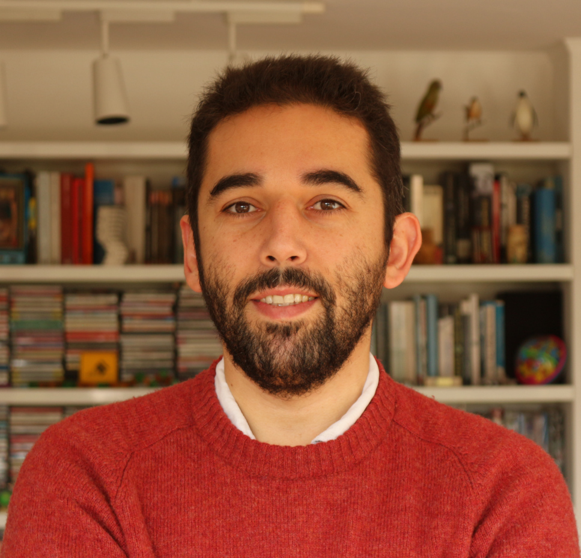

# Francisco Förster Burón

Welcome to my personal webpage!  

---

# About Me

{:style="width:200px; border-radius:50%;"}

I work at the intersection of astronomy, artificial intelligence, and data science.

My research focuses on time-domain astrophysics, supernova science, and the development of tools for astronomical discovery.

I am an astronomer and Full Professor at the Data and Artificial Intelligence Initiative ([IDIA](https://idia.uchile.cl/) at [Universidad de Chile](https://uchile.cl/). I am director of the Millennium Institute of Astrophysics ([MAS](https://astrofisicamas.cl/)) since 2024, Research Scientist at the Center for Mathematical Modelling ([CMM](https://www.cmm.uchile.cl/)) at Universidad de Chile, and Associate Researcher at the The Center of Excellence in Astrophysics and Related Technologies ([CATA](https://cata.cl/)). I used to be the principal investigator of the Automatic Learning for the Rapid Classification of Events ([ALeRCE](https://alerce.science/)), a Vera C. Rubin Community broker (2018-2024), and the High Cadence Transient Survey ([HiTS](https://alerce.science/high-cadence-transient-survey-hits/), 2012-2018). I led the installation of the CHASE 500 cm robotic telescope in CTIO (first light Oct 2010). I did my Ph.D. thesis on Type Ia Supernovae progenitors at the [University of Oxford](https://www.ox.ac.uk/) (2009) with Prof. Philipp Podsiadlowski.

---

# Research Interests

- Time-Domain Astrophysics
- Astroinformatics
- Machine Learning for Astronomical Transients
- Scientific Software Development

---

# Publications

Refereed publications in [ADS](https://ui.adsabs.harvard.edu/search/fq=%7B!type%3Daqp%20v%3D%24fq_database%7D&fq_database=(database%3Aastronomy%20OR%20database%3Aphysics)&q=author%3A%22forster%2C%20f%22%20collection%3Aastronomy%20property%3Arefereed&sort=date%20desc%2C%20bibcode%20desc&p_=0)

---

# Contact

Feel free to reach me via email (fforster at uchile dot cl) or connect on [LinkedIn](https://www.linkedin.com/in/franciscoforster/).

---